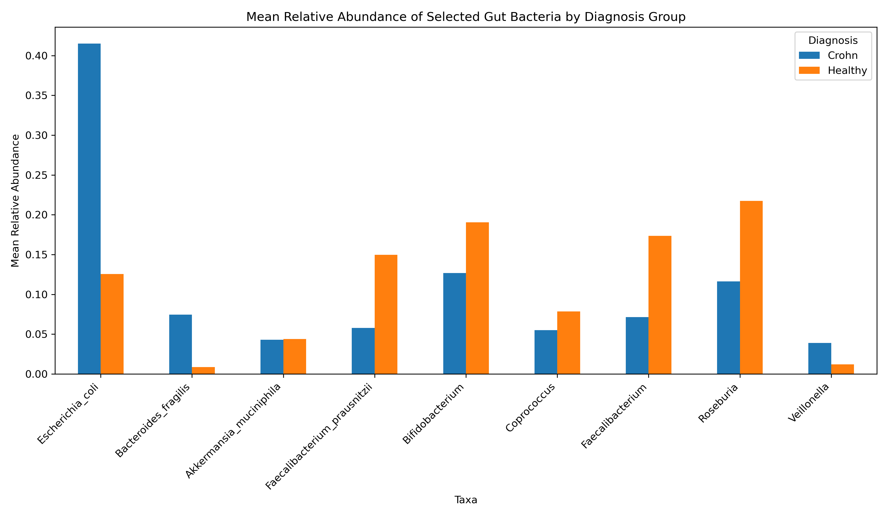
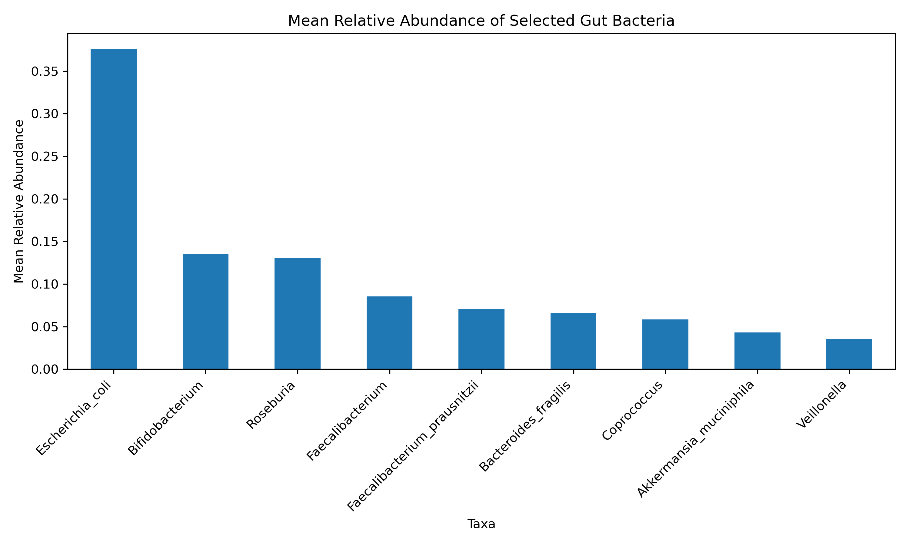
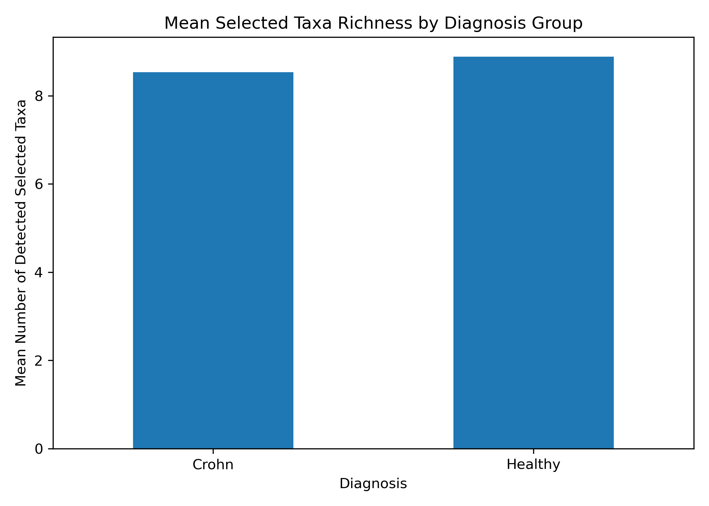

# Comparative Analysis of Gut Microbiome Composition in Crohn's Disease and Healthy Controls

[](https://www.python.org/)
[](https://pandas.pydata.org/)
[](https://matplotlib.org/)
[](LICENSE)

## Acknowledgment / Data Provenance

The cleaned dataset analyzed in this repository (`joined_MI_ready.csv`) was prepared and
made publicly available by
[brookeb2000/crohns-microbiome-analysis](https://github.com/brookeb2000/crohns-microbiome-analysis).

The underlying data come from [GMrepo](https://gmrepo.humangut.info/data/project/PRJEB42155),
project [PRJEB42155](https://www.ebi.ac.uk/ena/browser/view/PRJEB42155) (UCSD IBD 200 Patient
Cohort Multi-omic Project): shotgun metagenomics–derived relative abundances for 132 samples
(114 Crohn's disease, 18 healthy controls).

## Project Abstract

This project presents a comparative analysis of gut microbiome composition in individuals
with Crohn's disease and healthy controls, using Python for data preprocessing, exploratory
analysis, visualization, and result export.

The analysis focuses on relative abundance profiles of selected bacterial taxa and aims to
identify descriptive compositional differences associated with Crohn's disease.

## Dataset Description

The dataset includes microbiome samples labeled by diagnosis:

- Crohn
- Healthy

Each sample contains:

- metadata (`tube_id`, `Diagnosis`)
- relative abundance values for selected gut bacterial taxa:
  - `Escherichia_coli`
  - `Bacteroides_fragilis`
  - `Akkermansia_muciniphila`
  - `Faecalibacterium_prausnitzii`
  - `Bifidobacterium`
  - `Coprococcus`
  - `Faecalibacterium`
  - `Roseburia`
  - `Veillonella`

## Analysis Workflow

The script ([`SRC/analysis.py`](SRC/analysis.py)) performs the following steps:

1. Loads the dataset
2. Inspects structure, missing values, and data types
3. Separates metadata from taxa columns
4. Converts taxa values to numeric format
5. Computes summary statistics and mean abundances
6. Compares mean taxon abundance between diagnosis groups
7. Estimates presence-based richness across selected taxa
8. Generates plots and exports summary tables

## Main Findings

The analysis reveals clear descriptive differences between Crohn's disease samples and
healthy controls.

### Key observations

1. *Escherichia coli* is more abundant in the Crohn's disease group.
2. *Faecalibacterium prausnitzii*, *Faecalibacterium*, and *Roseburia* are reduced in
   Crohn's disease samples.
3. *Bifidobacterium* and *Coprococcus* also show lower mean abundance in Crohn's disease.
4. *Akkermansia muciniphila* remains relatively similar between groups.
5. Presence-based richness differs only modestly between the two groups.

Taken together, these findings suggest a disease-associated shift toward a more dysbiotic
microbial composition in Crohn's disease.



<p align="center">
  
  
</p>

## Interpretation Note

This project analyzes relative abundance data, **not** absolute bacterial counts. For that
reason, the results should be interpreted as compositional differences between groups,
rather than direct changes in total bacterial load. The analysis is descriptive and
biologically suggestive, but not causal.

## How to Run

```bash
pip install -r requirements.txt
python SRC/analysis.py
```

The script prints each check to the terminal, saves the figures to `Plots/` and the summary
tables (`mean_abundances.csv`, `sample_richness.csv`) to `Outputs/`. Each figure also opens
in a window; close it to continue, or run `MPLBACKEND=Agg python SRC/analysis.py` to skip
the windows.

## Author

**Charalampos Vlassakis** · [GitHub](https://github.com/HarisVl92)

Related project:
[crohns-disease-rnaseq](https://github.com/HarisVl92/crohns-disease-rnaseq), on the host
gene-expression side of Crohn's disease.

## License

The code in this repository is released under the [MIT License](LICENSE). The dataset in
`Data/` comes from the repository credited above and is redistributed under its own MIT
License (see [Data/LICENSE](Data/LICENSE)).
